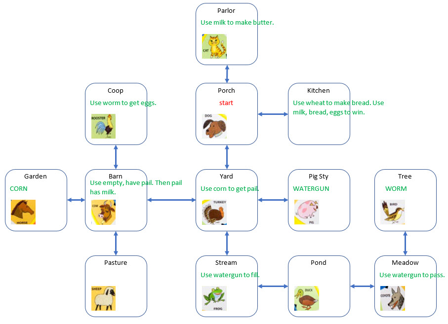

# The Farmer Cooks

Gary Dion's Audio Adventure Game on the Farmer Says

The ultimate goal is to make French Toast. The audio prompts include all 12 of the original animal: SHEEP, DOG, DUCK, FROG, HORSE, COYOTE, ROOSTER, PIG, COW, BIRD, CAT, TURKEY

Another audio adventure for the hardware:

[https://github.com/topherCantrell/vertiv-01-stovehouse-plans](https://github.com/topherCantrell/vertiv-01-stovehouse-plans)



## Introduction

Fine morning on the farm. Want French Toast for breakfast. Set out to make it.

## Win

Sit down with the dog and eat.

## Parlor (Cat)

There is a churn here. When you make butter, the cat drinks some of the milk (not a game trigger -- just a description).

```
"south":
    goto porch
    
"use pail-with-milk":   
    move butter to parlor
    move pail-with-milk gone
    move pail to parlor
    play madeButter
```

## Porch (Dog)

```
"north":
    goto parlor
    
"south":
    goto yard
    
"east":
    goto kitchen

"use empty":
    play random(happyDog1, happyDog2, happyDog3, happyDog4)
    
"use *":
    play random(madDog1, madDog2, madDog3, madDog4)
```

## Kitchen

There is a bread-pan warming in the oven. There is a hot skillet on the stove.

```
"west":
    goto porch
    
"use wheat":
    move bread to kitchen
    move wheat to gone
    play madeBread
    
"use bread":    
    move bread to gone
    play addedBread
    if bread in gone and eggs in gone and butter in gone:
        play win
        end
    
"use eggs":
    move eggs to gone
    play addedEggs
    if bread in gone and eggs in gone and butter in gone:
        play win
        end
    
"use butter":    
    move butter to gone
    play addedButter
    if bread in gone and eggs in gone and butter in gone:
        play win
        end
```

## Chicken Coop (Rooster)

Hungry rooster guarding the hen house. When you feed him the worm, he goes and brings you eggs for a reward.

```
"south":
    goto barn
    
"use worm":
    move eggs to coop
    move worm to gone
    play ateWorm
    
"use *":
    play heDoesntLikeThat
```

## Garden (Horse)

Horse is waiting on you to start plowing. Corn stalks growing.

```
corn starts here

"east":
    goto barn

```

## Barn (Cow)

```
"north":
    goto coop
    
"south":
    goto pasture
    
"east":
    goto yard
    
"west":
    goto garden
    
"use empty":
    if pail-empty in otherHand
        play milkedCow
    elif pail-with-milk in otherHand
        play topOffThePail
    else
        play needTheRightTools
    
"use pail-empty":
    play tryUsingYourHand    
```

## Yard (Turkey)

Turkey is sitting on the pail and keeps you from getting it.

```
guarded-pail starts here

"north":
    goto porch
    
"south":
    goto stream
    
"east":
    goto pigsty

"west":
    goto barn

"use corn":
    move guarded-pail to gone
    move pail-empty to yard
    move turkey-fed to yard
    move corn to gone
    play fedTurkey
```

## Pig Sty (Pig)

This pig is dirty and wants a bath. He's not too sure about this breakfast thing.

```
watergun-empty starts here

"west":
    goto yard
    
"use watergun-full":
    play random(pig1, pig2, pig3, pig4)
    
"use watergun-empty":
    play sadPig
```

## Tree (Bird)

The bird got up early and couldn't eat another worm.

```
worm starts here

"south":
    goto meadow
```

## Pasture (Sheep)

```
"north":
    goto barn
```

## Stream (Frog)

You can easily reach the water.

```
"north":
    goto yard
    
"east":
    goto pond
    
"use watergun-full":
    play topOffWatergun
    
"use watergun-empty":
    move hand to gone
    move watergun-full to hand
    play fillWatergun
    
"use empty":
    play waterFeelsCold
    
"use *":
    play dipThatInTheWater
```

## Pond (Duck)

```
"east":
    goto meadow
    
"west":
    goto stream
```

## Meadow (Coyote)

Grove of trees to the north. A coyote guards the path. You don't dare try it.

```
"north":
    play pathBlocked

"west":
    goto pond
        
"use watergun-full":
    play slippedBy
    goto tree
```
